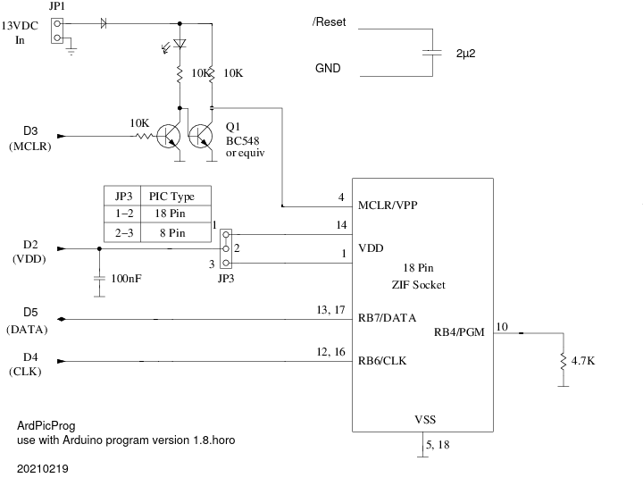

# Arduino-based PIC programmer

This distribution contains an Arduino-based solution for programming
PIC microcontrollers from Microchip Technology Inc, such as the
PIC16F628A and friends.  The solution has three parts:

* Circuit to interface to the PIC and provide the HV programming voltage.

  

* Firmware called [ProgramPIC](tree/main/ProgramPic) that is loaded into an Arduino to directly
  interface with the PIC during programming. This program implements a
  simple serial protocol for interfacing with the host.

* Host program called [ardpicprog](tree/main/ArdPicProg); a drop-in replacement for
  [picprog](http://hyvatti.iki.fi/~jaakko/pic/picprog.html) that
  implements the serial protocol and controls the PIC programming
  process on the computer side. Tested under Linux, should also work on Windows.

